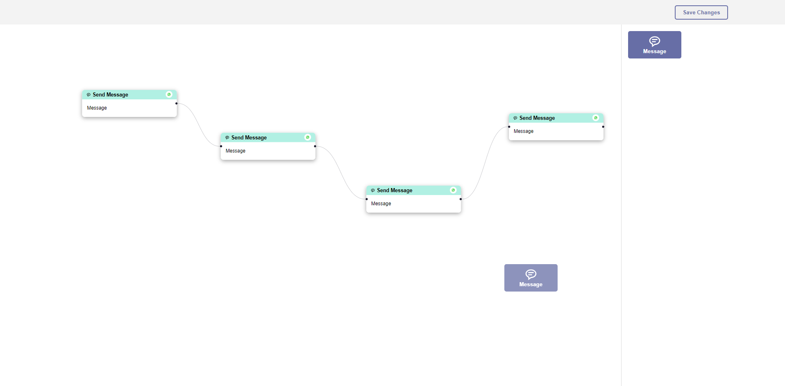

<!-- Please update value in the {}  -->

<h1 align="center">FitMerch🛒</h1>

  <h3>
    <a href="https://bitespeed-chatflowbuilder.netlify.app" target="_blank">
     >> Demo <<
    </a>   
  </h3>

<!-- OVERVIEW -->

## Overview

### About

This is a chatbot flow builder.

Chatbot flow is built by connecting multiple messages together to decide the order of execution.

### Features

- Adding message nodes to flow with drag-drop.

- Connecting message nodes.

- Editing message nodes.

- Saving Flow.

### Upcoming Features

- Uploading audio to message nodes.

- Uploading media to message nodes.

### Built With

<!-- This section should list any major frameworks that you built your project using. Here are a few examples.-->

- React
- React-flow
- Emotion Styled Components
- Netlify

## Contact

- Website [ScriptoPlankton](https://sandeep.netlify.app/)
- GitHub [@sandeepashok](https://github.com/sandeepashok)
- Gmail [Sandeep98a@gmail.com](sandeep98a@gmail.com)
